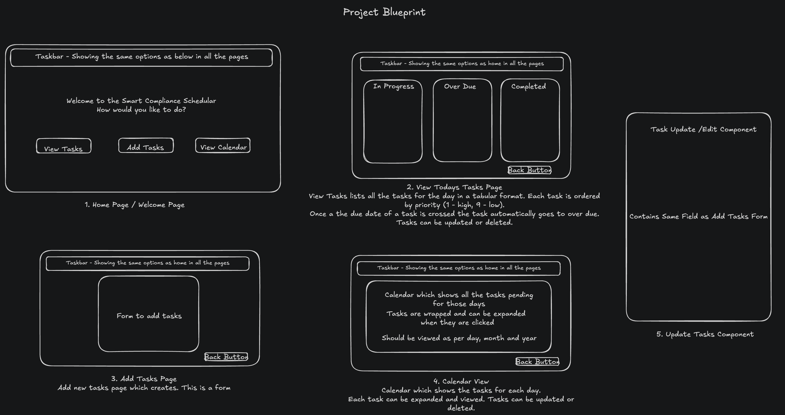

# Smart Compliance Scheduler

A full-stack web application designed to help compliance professionals efficiently schedule, track, and manage regulatory tasks. Built with **React**, **Spring Boot**, and **MySQL**, the application provides intuitive interfaces, secure data handling, and powerful task organization features.

---

## Features

- **Task Management**: Create, view, edit, and delete compliance tasks with details including heading, description, due date, due time, status, priority, and people involved.
- **Table & Calendar Views**: Toggle between a modern table and an interactive calendar to visualize and organize tasks by date, priority, or status.
- **File Attachments**: Upload and associate relevant documents with tasks for easy reference and record-keeping.
- **AI Chatbot**: Floating assistant enables users to create tasks or get help through natural language chat, powered by OpenAI GPT-3.5.
- **Robust Backend Handling**: Backend logic safely distinguishes between structured (task) and unstructured (chat/help) AI replies.
- **Multi-User Collaboration**: Assign tasks to multiple stakeholders by adding their email addresses.
- **Responsive UI**: Clean, accessible design with a focus on usability for professionals aged 50+.

*Reminders and AI assistant features are planned for future updates.*

---

## Tech Stack

- **Frontend**: React (with React Router, custom CSS)
- **Backend**: Spring Boot (Java, REST APIs, Hibernate/JPA, OpenAI integration)
- **Database**: MySQL

---

## Project Blueprint



---

## Getting Started

### Prerequisites

- Node.js & npm
- Java JDK 17+
- Maven
- MySQL

### Setup

#### 1. Clone the Repository
```bash
git clone https://github.com/your-username/smart-compliance-scheduler.git
cd smart-compliance-scheduler
```

#### 2. Backend Setup
```bash
cd backend
mvn spring-boot:run
```

#### 2. Frontend Setup
```bash
cd frontend
npm install
npm start
```

## Configuration Notes

### 1. Create an application.properties file in backend/src/main/resources
### 2. Add these to your application.properties file


```bash
spring.application.name=backend
spring.datasource.url=jdbc:mysql://localhost:3306/compliance_scheduler
spring.datasource.username=root
spring.datasource.password=DB_PASSWORD
spring.jpa.hibernate.ddl-auto=update
spring.jpa.show-sql=true
spring.jpa.properties.hibernate.format_sql=true
openai.api.key=OpenAiAPIKey
openai.model=gpt-3.5-turbo
```
